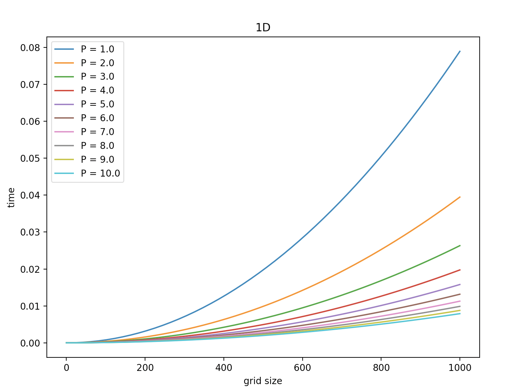
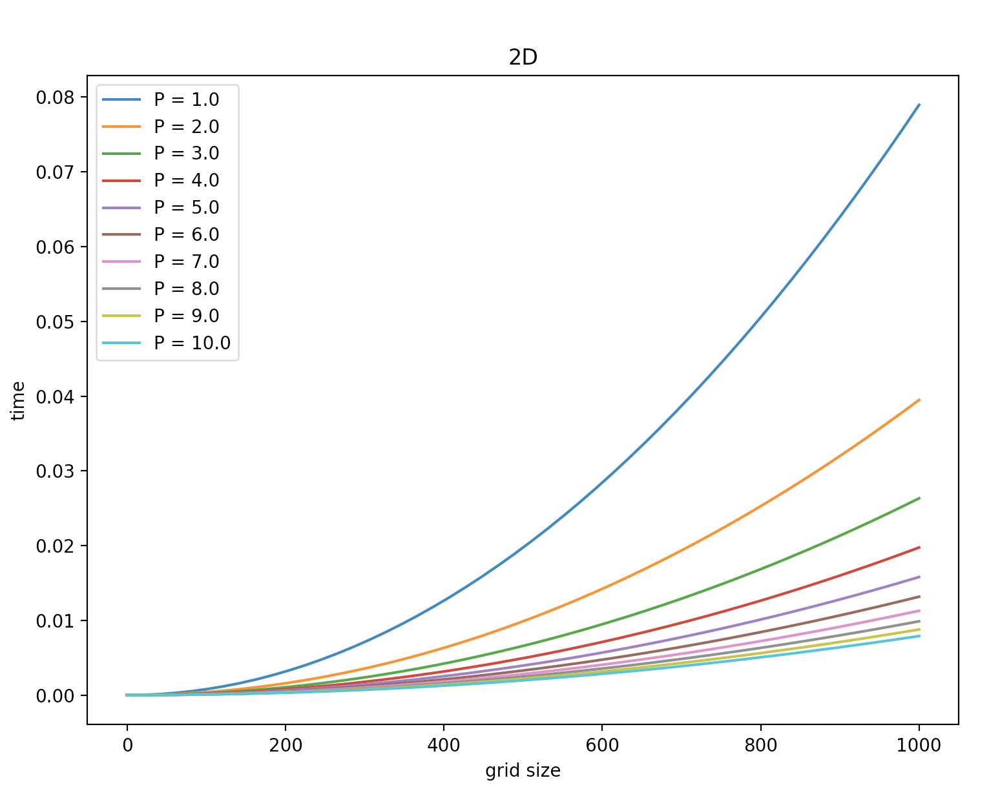

# MPI GameOfLife 

## PCAM process: 

* Partitioning: 
	
	I have decomposed the computation for each task is to tell whether a cell will be alive or not. 

* Communication: 

	Since the each cell needs its 8 nearing neighbors to compute, there will have 8 communication if each node takes each cell. 

* Agglomeration: 

	For column decomposition, I join the cells into columns, which creates a pencil shape for each node to compute. This leads to that each node will only need to communite to 2 neighboring nodes to get the left and right neighbors. 

	For 2D decomposition, I join the cells into small blocks, which creates combines both rows and columns of cells into small blocks. This can lead to that each node has to communicate with 8 different directions to get the neighboring cells. 

* Mapping: 

	For column decomposition, if columns can be divided evenly among the number of nodes, then each node will get the same amount of columns. If they are uneven, then some nodes will have one or two more than the others. 

	For 2D decomposition, if blocks can be divided evenly among the number of nodes, then each node will have same size of the block. If not, then some of the node will have a smaller block to compute. 


## Detail: 

My approach is to assume the grid of cells is square and the number of proccess has to be able to split into 2x2 or 3x3 grid in order to split the cells into blocks. 
I have a check to see if it is able to split, if not then it will terminate and ask for new setup.  

In `gol.f90`, I have just implement 4 nodes and 2x2 grid of nodes, to compute with the 20x20 grid. 


## Game of Life with 2D decomposition: 
* gol.f90: is the 2D  decomposition of Game of Life 

To compile and run the program
```
mpif90 -o gol gol.f90
```

boot up the compute node and go to the directory where you compile. 
```
mpirun -np <# of processes>(4) gol
```

## Game of Life with column decomposition: 
* gol_col.f90: is a column decomposition of the Game of Life

To compile and run the program
```
mpif90 -o gol_col gol_col.f90
```

boot up the compute node and go to the directory where you compile. 
```
mpirun -np <# of processes>(4) gol_col
```

## Game of Life with serial: 
* temp.f90: is a serial way of doing Game of Life 

To compile and run the program
```
gfortran -o temp temp.f90
```

boot up the compute node and go to the directory where you compile. 
```
./temp
```


Output of this porgram will use 20x20 grid and runs 80 iterations which will return the same output as initial location.

The sample output of this run is in the `output.txt`

If you want to change to different iteration, you can find the `do loop` to change the bounds of the loop to run 20, 40, 60, 80 iterations 


## Time 


For 1D decomposition of Game of Life, we assume the grid is $N_x \times N_y$, so each processor has $N_y \times 1$ which is a column with $N_y$ elements. 

Since $T_{comp} = t_c N_x N_y$, for non replicated computation and $T_{comm} = 2P(t_s + t_w N_y)$, 

$$T_{1D} = \frac{t_{c} N_x N_y}{P} + 2t_s + 2t_w N_y$$

$$E_{1D} = \frac{t_c N_x N_y}{t_{c} N_x N_y + 2Pt_s + 2Pt_w N_y}$$

To make $E_{1D}$ constant, replace $N_x$ with $P$
$$E_{1D} (t_{c} P N_y + 2Pt_s + 2Pt_w N_y)= t_c P N_y$$
$$E_{1D} (t_{c} N_y + 2t_s + 2t_w N_y) = t_c N_y$$
$$E_{1D} = \frac{ t_c N_y}{t_{c} N_y + 2t_s + 2t_w N_y} \text{(constant)}$$

The total computation is $O(N)$ for constant efficiency

We can plug the $t_c, t_s, t_w$ in to plot the model 

</br>


For 2D decomposition of Game of Life, we assume the grid is $N_x \times N_y$, so each processor has $\frac{N_x}{\sqrt{P}} \times \frac{N_y}{\sqrt{P}}$

Since $T_{comp} = t_c N_x N_y$, for none replicated computation and $T_{comm} = 2P(t_s + \frac{N_x}{\sqrt{P}}t_w) + 2P(t_s + \frac{N_y}{\sqrt{P}}t_w) + 4P(t_s + t_w)$, 

$2P(t_s + \frac{N_x}{\sqrt{P}}t_w)$ is for the top, and bot ghost cells, 

$2P(t_s + \frac{N_y}{\sqrt{P}}t_w)$ is for the left and right ghost cells,

$4P(t_s + t_w)$ if for all four corners of the ghost cells 


$$T_{2D} =  \frac{t_{c} N_x N_y}{P}+ 2(t_s + \frac{N_x}{\sqrt{P}}t_w) + 2(t_s + \frac{N_y}{\sqrt{P}}t_w)+ 4(t_s + t_w)$$

$$T_{2D} =  \frac{t_{c} N_x N_y}{P}+ 8t_s + 2\frac{N_x}{\sqrt{P}}t_w + 2\frac{N_y}{\sqrt{P}}t_w + 4t_w$$

$$E_{2D} = \frac{t_{c} N_x N_y}{t_{c} N_x N_y + 2\sqrt{P}N_x t_w + 2 \sqrt{P} N_y t_w + 4Pt_w}$$

To make $E_{2D}$ constant, replace $N_x$ and $N_y$ with $\sqrt{P}$

$$E_{2D}(t_{c} P + 2P t_w + 2P t_w + 4Pt_w) = t_{c} P$$ 

$$E_{2D} = \frac{t_c}{t_c + 8t_w} \text{(constant)} $$

The total computation is $O(N^2)$ for constant efficiency, but scaling with $O(P)$ which is more scalable 
 
</br>
From ones.f90, I get $t_c = 7.89e-08$

From latency.f90, I get $t_s = 3.88 e-06$ and $t_w = 3.48e-09$




